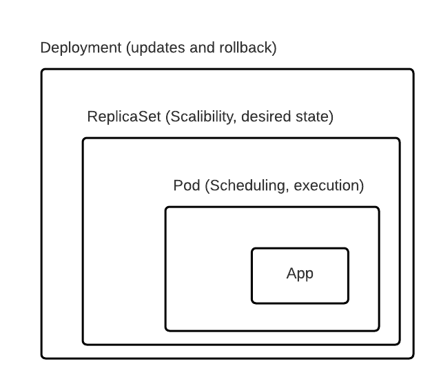

# Duc’s Kubernetes glossary

**K8s**: Shortcut for Kubernetes, 8 because there are 8 characters between the start and last character.

P**od:** A group of containers and is the smallest deployable unit in k8s. Normally there is an application container and a sidecar container that handle logging, security, etc. 

Why pods and not container itself?

Kubernetes uses pod as an abstraction layer instead of container itself, because there are containers that are tightly coupled together. With pod you can always deploy those containers together. Also the containers inside the pod can communicate with each other faster without the need of encryption. In normal cases there are a container and a sidecar container inside.

Why should pod be small?

Because you don’t want to waste resources. Imagine a pod can handle ten requests at a time and there are always 50 requests coming in. You would have five pods to handle all the request because 50 / 10 = 5 pods. Imagine the pod is really big and can handle 40 requests at a time. For 50 requests you would require two pods because 50 / 40 = 1.2 pods. You can’t have 0.2 pods, so you create a complete new pod. But now the second pod is not being completely utilized and 80% of the capacity is free.

**Liveness probes:** To know when to restart a container

**Readiness probes:** To know when a container is ready to start accepting traffic. When a pod is not ready, it is removed from the service load balancers

R**eplicaset**: One layer above pod and ensures that there are always a desired amount of containers (desired state). But be careful, the user don’t get to decide on which nodes the pod will be!

**Statefulset**: It’s the same as a replicaset, just for stateful applications

**Daemonset:** ensures that a copy of the pods is running on all the node

D**eployment:** One layer above replicaset and manages rollback and update of containers. Rolling update, etc.

**Job:** It’s used when you don’t want a pod to run definitely. For example you want to have a pod that start and do some tasks. When the tasks are done, the pod should shut itself down. With other methods like deployment, statefulset or daemonset the pods run indefinitely.

Job works by keeping tracks if the pod have done their tasks. The job knows that the tasks are finished when the pod terminated itself. If the job see that the pod can’t fulfill its job, it will automatically create a new pod. The pods and the job still exist after the tasks are done though. You need to manually remove the job and the pods will get deleted with it. For Job you don’t need to define a pod selector.

**Cronjob:** creates jobs on a repeating schedule.

**Service:** acts as communication gateway to pods.

Why do we even need a service? Each pod has an IP address and we can forward the traffic directly to the pods right?

Pods die and restarted dynamically and every time they get a new IP address. We can’t keep track of all the pods IP, so we use Service as an interface. Service then forward the traffic to the pods and also acts as a load balancer.

How do Service know to which pods it should forward the traffic/request to?

Each pod has a tag and service only transfer request requests to those with the right tag. Service also uses tag to do rolling deployments. Rolling deployment is when Kubernetes creates newer version of pods and redirect traffic to them while shutting old pods down. Newer version of the container have a different tags so Service knows, which one to transfer traffic to.

Here are multiple different types of services:

1. **ClusterIP -** Expose the service on a cluster-internal IP (default). It allows services inside the cluster to speak to each other but only the services **inside the cluster.**

2. **Nodeport** - Expose the service to the outside world by assigning the service a nodeport. Nodeport can be use for demo purpose but shouldn’t be used in production because you can only expose one single service per port and the nodeport only ranges between 30000 - 326767

3. **LoadBalancer** - Provision an external IP to act as a load balancer for the service. This service is offered mainly by the hyperscalers and it’s a good way to expose the service to the outside world. One disadvantage though is that you need to create a loadbalancer for each service, which can be really expensive.

4. **ExternalName** - Maps a service to a DNS name

**Ingress:** It’s a router and acts as an entry point to the cluster. It’s wrapper around multiple other services and offers a lot of functionality. It’s also really complicated.

Volume: ****

- **hostPath** **Volume**: binds host storage place to k8s storage place
- **Persistent Volume(pv):** An interface for real storage. It is an external plugin to the cluster
- **Persistent Volume Claim(pvc):** Pod uses persistent volume claim to access persistent volume
- **Storage class:** Since you would need thousand of persistent volume for each application and each persistent volume needs to be created manually, the process would take too much time. Storage class solves this problem by provisioning persistent volume dynamically when pvc claims it.

**Stateful vs stateless:** stateful applications are like database. The database pods need to be in sync to prevent data loss. Through that the pods can’t be killed and restarted easily. Stateless apps don’t have data and can be restarted and replicated easily.

O**perator**: K8s can manage the lifecycle of a stateless app but can’t manage the lifecycle for stateful app like database. To solve this problem, operator was created. There is an operator for each technology like Postgres operator, Elasticsearch operator, Prometheus operator. Those operator manage the lifecycle of those stateful apps. To find more operator, see operator hub. 

The development of an operator is mainly supported by the experts of a certain technology. For example the Prometheus operator is mainly created by the Prometheus team, not from k8s team.

N**amespace:**  a virtual “cluster” inside your cluster. It is use to separate your k8s resources into meaningful separate environments. In small projects all the resources are in the namespace “default”. In bigger projects you can group your grouped after their functions like a namespace for “database”, “monitoring”, “nginx-ingress”.

**Configmap:** allows you to store configs data that you can inject into your pods later. The config data either are save as key value pairs or in a config file.

**Secrets:** It’s the same as configmap but for sensitive data. The data that you inject into the pods need to be encrypted with base64 first.

**Helm chart:** You define your Kubernetes templates with yaml just like when you do it with Kubernetes. The difference is that you don’t insert the value into the template (chart) directly but instead define those values on a separate file and inject those values into the chart. Helm is comparable to npm/pip and chart is comparable to node modules/python packages.

**K8s architecture component**

**Cluster:** consists of master nodes and worker nodes. Master node is like a manager that doesn’t do any work itself and just commands the workers (worker node) to do the job. Master node is responsible for talking with the customer (user), receiving requests from them and translate those requests into tasks for the workers.

Why do we need multiple clusters?

- Application isolation. Different clusters for staging and production
- easier diagnose issues, since configurations only affect a cluster
- regulatory compliance, data needs to reside within geographical limits

**Worker node**: A virtual machine, a physical machine or a cloud instance. It contains

- **a container runtime**: It used to be Docker but now it got abstracted through the Container Runtime Interface (CRI). Alternatives to Docker are gVisor, katacontainers, containerd
- **kubelet**: talks to the control planes, register the vm as a node to the cluster. When a pod is assigned to the worker node, kubelet will pull the spec and runs the pod.
- **kube-proxy**: handle networking, give pods ip endpoints

M**aster node(control plane)**: responsible for handling the workload to the worker nodes

- **API Server**: entry point to the control plane, pods and user send request to the api server. Even all the components in the control plane talk to each other through the api server. It consumes json and yaml.
- **etcd**: key-value store that persists cluster state config data on distributed systems. Example for how it works: When a client passes an updated value (change random number from 7 to 17) to the leader master node, the leader will try to send those updated data to the follower. When the **majority** of the worker nodes have the updated data (17), the leader will notify the client, that the data is updated. Noted that even through there are still some nodes that still contains the old data (7) and needed to be updated yet. Now when a client sends a request to a worker node to ask what the value the random number has, the worker node are not permitted to directly answer the request. It will passes the request to the leader and forwards the answer to the client.
- **Scheduler**: decides on which nodes the pod will run. It has policies on how those pods will get deployed like predicates and priorities. **Predicates** are hard constraints like memory requirement (“this pod can only being deployed on machine with more than 4gb ram”) and the pod only get deployed on those node that fulfill the requirements. A predicate could also be a node selector, where the pods get deployed on those node with a certain tag.
    
    **Priorities** on the other hand are soft constraints than can be violated but would be nice if it gets fulfilled. An example for priority is spreading, where it would be good if the pods are deployed on multiple nodes.
    
- **Controller Manager**: Lifecycle management. It contains different other controllers like node controller, deployment controller, endpoints controller, namespace controller,...
- **Cloud Controller**: Lets Kubernetes hook into cloud providers (hyperscalers)

There should always be an uneven numbers of master nodes (= control plane) ⇒ consensus, in the case where the master nodes can’t speak with each others, a majority can be form. For example in the case of three master nodes and one master node gets split up, the other two master nodes can form the majority and continuing making changes (deploying pods). The other master node go to read-only mode.

The master nodes should be in different locations for security and availability reasons. For example if all of them are on the same networks and that network disconnected, all master nodes would also die.

The master nodes follows the concept of leader and followers. There is always one leader master node that makes changes! Other master nodes are just followers and just proxy requests to the leaders. If the leader goes down, the followers come together and elect a new leader.

Normally there are 3 or 5 master nodes. 1 master node is also possible. 7 or 9 nodes are overkill since it takes longer to make a decision.

Hyperscalers offers Kubernetes as a Service. They take the control planes away and just offers you an API endpoint. You don’t need to care about where to schedule the master nodes and how many master nodes should be available.